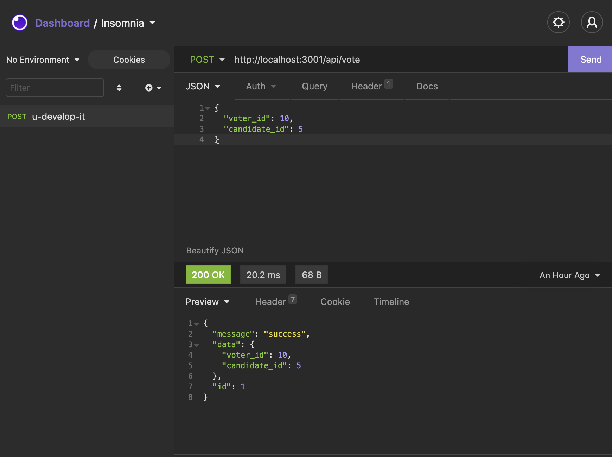

# u-develop-it

SQL Database for voting app.



|                                         |                                         |                                                   |
| :-------------------------------------: | :-------------------------------------: | :-----------------------------------------------: |
|      [Introduction](#u-develop-it)      | [Table of Contents](#table-of-contents) | [Development Highlights](#development-highlights) |
|      [Installation](#installation)      |             [Tests](#tests)             |       [Code Hightlights](#code-highlights)        |
| [Technologies Used](#Technologies-Used) |           [Credits](#Credits)           |                [License](#License)                |

## Development Highlight

- Connected to a SQLite database from Node.js.
- Use queries to access information and join tables.
- Use insomia to test GET, POST, PUT, and DELETE Routes.
- Performed CRUD operations on a table using INSERT, SELECT, UPDATE, and DELETE.

## Installation

Install dependencies.

```
npm i
```

Run schema

```
npm run migrate
```

Run seeds

```
npm run seed
```

Run the app.

```
node server.js
```

## Test

```
npm test
```

## Code Highlights

GET route by candidates id. A query is made to the candiates table and is joined by parties based on the party id.

```JavaScript
router.get('/candidate/:id', (req, res) => {
    const sql = `SELECT candidates.*, parties.name
    AS party_name
    FROM candidates
    LEFT JOIN parties
    ON candidates.party_id = parties.id
    WHERE candidates.id = ?`;
    const params = [req.params.id];
    db.get(sql, params, (err, row) => {
        if (err) {
            res.status(400).json({ error: err.message });
            return;
        }
        res.json({
            message: 'success',
            data: row
        });
    });
});
```

A post route for the voter to cast a vote for which candidate they want.

```JavaScript
router.post('/vote', ({ body }, res) => {
    const errors = inputCheck(body, 'voter_id', 'candidate_id');
    if (errors) {
        res.status(400).json({ error: errors });
        return;
    }

    const sql = `INSERT INTO votes (voter_id, candidate_id) VALUES (?,?)`;
    const params = [body.voter_id, body.candidate_id];

    db.run(sql, params, function (err, result) {
        if (err) {
            res.status(400).json({ error: err.message });
            return;
        }
        res.json({
            message: 'success',
            data: body,
            id: this.lastID
        });
    });
});
```

## Technologies Used

### Backend Language

-[Node.js](https://nodejs.org/en/)

### Backend Framework

- [Express](https://expressjs.com/)

### Database

-[SQLite](https://www.sqlite.org/index.html)

### Testing

- [jest](https://jestjs.io/);

## Credits

|                           |                                                                                                                                                                                                       |
| ------------------------- | ----------------------------------------------------------------------------------------------------------------------------------------------------------------------------------------------------- |
| **David Anusontarangkul** | [ LinkedIn](https://www.linkedin.com/in/anusontarangkul/) [ GitHub](https://github.com/anusontarangkul) |

## License

[](https://opensource.org/licenses/MIT)
